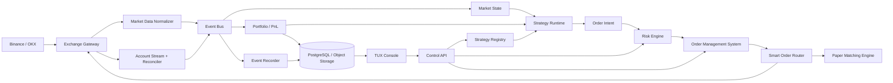

# TUX Quant

> **TUX = Trading Unified eXecution**  
> 面向个人量化团队和小型交易团队的统一量化交易与执行平台。

TUX Quant 从零设计，目标是统一支持 Binance 与 OKX、现货与合约、本地虚拟盘与交易所模拟盘及实盘，并允许多个策略独立运行、动态调整、审计和回滚。

## 产品定位

平台由以下产品模块组成：

- **TUX Lab**：策略研究、历史回测和参数分析。
- **TUX Sim**：实时行情驱动的本地虚拟撮合，以及交易所 Testnet/Demo。
- **TUX Core**：行情、账户、订单、持仓、风控和执行核心。
- **TUX Console**：Web 管理台与实时监控。
- **tuxd**：部署在交易节点上的守护进程。

### 核心能力

- Binance、OKX 统一接入。
- 现货、U 本位永续；后续扩展币本位与交割合约。
- 回放回测、Local Paper、Exchange Demo 和 Live 四种运行模式。
- 多账户、多交易对、多策略实例并行运行。
- 策略参数热更新、版本升级、灰度发布和快速回滚。
- 回测、虚拟盘和实盘共用策略及订单接口。
- 实时风控、账户对账、事件审计和数据可视化。

## 运行模式

| 模式 | 行情 | 撮合 | 主要用途 |
|---|---|---|---|
| Replay Backtest | 历史数据 | 本地撮合 | 策略研究和参数筛选 |
| Local Paper | 实时行情 | 本地撮合 | 长时间无资金观察 |
| Exchange Demo | 交易所模拟环境 | 交易所撮合 | API、订单和账户链路验证 |
| Live | 实时行情 | 实盘撮合 | 正式交易 |

## Docker 镜像

推送到 `main` 或 `v*` 标签时，GitHub Actions 会构建 `tuxd` 镜像并发布到
`ghcr.io/lilyias/tux-trader`。Pull Request 只执行镜像构建检查，不会推送镜像。

```bash
docker pull ghcr.io/lilyias/tux-trader:latest
docker run --rm -p 8080:8080 -v tux-data:/data ghcr.io/lilyias/tux-trader:latest
```

容器默认运行 Local Paper 模式，Dashboard 地址为 `http://127.0.0.1:8080/`，
SQLite 数据保存在 `/data/tux.db`。镜像不会启用实盘交易。

环境配置必须使用 `venue + product + environment` 三元组，不能依赖单一的 `demo` 布尔值。Binance 不同产品的 Testnet/Demo 能力并不完全相同；OKX Demo REST 请求需要模拟交易请求头，并使用对应的 Demo WebSocket。所有端点都应配置化，以适应交易所和地区差异。

## 产品功能

### 总览

展示账户权益、可用余额、持仓、毛收益、净收益、手续费、资金费率、回撤、连接状态和风险状态。

### 策略中心

管理策略定义、不可变版本、参数 Schema、策略实例、运行环境和生命周期。推荐生命周期：

```text
Draft → Backtest → Paper → Exchange Demo → Shadow → Live → Paused/Retired
```

### 交易中心

展示订单、成交、持仓、余额、拒单、延迟及交易所原始响应，并支持按账户、策略、交易对和环境筛选。

### 风控中心

配置单笔限额、最大仓位、最大杠杆、最大活动订单、日亏损、最大回撤、价格偏离、陈旧行情、连续拒单熔断和全局 Kill Switch。

### 连接中心

管理 API 连接、权限检查、限流状态、时间同步、WebSocket 延迟、断线重连和账户对账结果。

## 总体架构



逻辑模块不等于初期必须拆成微服务。MVP 建议只部署四个进程：

1. `tux-control`：控制 API、配置、认证和 WebSocket 推送。
2. `tux-trader`：行情、账户、OMS、风控和交易所适配器。
3. `tux-strategy-worker`：隔离运行 Rust 或 Python 策略。
4. `tux-console`：Web 管理台。

## 技术方案

### 技术栈

- **交易核心**：Rust、Tokio。
- **控制 API**：Axum，REST + WebSocket。
- **策略通信**：gRPC + Protocol Buffers。
- **数值类型**：`rust_decimal`；价格、数量和费用禁止使用 `f64` 记账。
- **事务数据**：PostgreSQL，保存账户、配置、订单、成交和审计索引。
- **历史数据**：S3/MinIO + Parquet，保存不可变行情和事件日志。
- **事件总线**：MVP 使用 NATS JetStream；规模扩大后再评估 Kafka/Redpanda。
- **分析存储**：二期引入 ClickHouse，用于高频行情和统计查询。
- **前端**：TypeScript + React。
- **可观测性**：OpenTelemetry、Prometheus、Grafana 和集中式日志。

### 统一领域模型

```text
Venue + Environment + Product + Instrument
Account + Balance + Position + Exposure
OrderIntent + Order + Fill + Fee + Funding
```

`Instrument` 必须保存价格精度、数量步长、最小名义金额、合约乘数、保证金币种和结算币种。合约订单还必须表达：

- 单向或双向持仓模式。
- 全仓或逐仓模式。
- 杠杆倍数。
- `reduce_only` 和 `position_side`。
- 标记价格、强平价格及资金费率。

现货余额不能直接等同于合约 Position，应在 Portfolio 层统一转换为 Exposure，同时保留各自语义。

## 交易所适配器

每个适配器实现统一端口：

```text
MarketDataPort
AccountPort
ExecutionPort
InstrumentMetadataPort
FeeSchedulePort
```

职责包括：

- REST/WebSocket 鉴权和签名。
- 行情快照与增量序号校验。
- 时间同步、限流、重试和指数退避。
- 交易规则及手续费同步。
- 订单、成交、余额和持仓标准化。
- 启动和重连后的账户对账。

推荐使用“先启动并缓冲私有 WebSocket，再读取 REST 快照，最后合并快照后的增量事件”的启动流程，避免初始化窗口内丢失订单或成交。

## 订单管理系统

统一订单状态机：

```text
Created → RiskApproved → Submitted → Acknowledged
              ├→ PartiallyFilled → Filled
              ├→ CancelPending → Cancelled
              ├→ Rejected
              └→ Unknown → Reconcile
```

关键规则：

- 每个订单使用全局唯一且符合交易所约束的 `client_order_id`。
- `Unknown` 状态禁止盲目重试，必须先查询交易所，防止重复下单。
- REST 成功响应不代表最终成交，最终状态以私有事件流和主动对账为准。
- 启动、断线、超时和异常退出后都必须同步活动订单、成交、余额和持仓。
- 所有原始交易所响应与标准化事件都写入审计日志。

## 策略运行时

首版提供 Rust Strategy SDK 和 Python Strategy SDK。每个策略在独立 Worker 中运行，不能直接访问 API Key，也不能绕过风险引擎。

建议接口：

```text
on_start(context)
on_market(event, state) -> OrderIntent[]
on_account(event, state) -> OrderIntent[]
on_config_update(old, new)
on_timer(time)
snapshot() / restore()
on_stop(reason)
```

### 动态调整

动态能力分为两类：

1. **参数热更新**：指标周期、阈值、仓位和交易对在明确事件边界原子生效。
2. **策略版本升级**：新版本依次通过 Backtest、Paper、Shadow 和 Canary 后切换 Live。

每次变更必须记录策略版本、配置版本、生效事件序号、操作者、变更前后值和回滚目标。不建议在实盘进程内直接热加载任意动态库；首版采用独立 Worker 重启和状态快照恢复，未来需要运行不可信策略时再增加 WASM 沙箱。

## 虚拟撮合引擎

Paper Engine 与真实交易所使用同一 `ExecutionPort`，至少提供三种成交模型：

- `Immediate`：触价即成交，适合单元测试和快速回测。
- `L1`：基于最优买卖价及可用成交量模拟。
- `Queue`：估算挂单前方队列，适合 Maker 策略。

虚拟撮合必须覆盖：

- Maker/Taker 手续费。
- 滑点和网络延迟。
- 部分成交和订单过期。
- Post-only 拒单。
- Tick size、数量步长和最小名义金额。
- 合约乘数、保证金、资金费率和强平估算。
- 可重复的随机种子和确定性事件回放。

## PnL 与账务

系统至少分别记录：

```text
gross_realized_pnl
unrealized_pnl
trading_fees
funding_fees
borrow_interest
net_pnl
```

PnL 计算采用事件溯源：成交、手续费、资金费率、余额变化和人工调整均作为不可变账务事件保存。平台计算结果需要定期与交易所账单核对，并记录差异和修正事件。

## 风控与安全

策略只产生 `OrderIntent`，所有订单必须经过独立 Risk Engine。风控至少包括：

- 交易所、账户、产品和交易对白名单。
- 单笔、单策略、单账户最大名义金额。
- 最大仓位、净敞口和杠杆。
- 最大活动订单数和请求速率。
- 价格偏离、盘口深度和陈旧行情检查。
- 日亏损、最大回撤和连续拒单熔断。
- 保证金率和强平距离。
- 行情或账户连接断开时自动暂停策略。
- 全局撤单以及可配置的紧急平仓 Kill Switch。

### 凭据与实盘保护

- Demo 与 Live 使用不同 API Key、进程和数据库命名空间。
- API Key 只授予 Read/Trade，禁止 Withdraw。
- 使用 Vault/KMS 或操作系统密钥存储，数据库不保存明文密钥。
- 配置交易所 IP 白名单。
- 实盘启用需要显式二次确认。
- 完成账户、订单和持仓对账前，策略始终保持禁用。
- Dashboard 默认只读；交易操作需要独立权限和审计。

## 交付路线

### 阶段 1：现货 MVP，6–8 周

- 统一领域模型和事件协议。
- Binance、OKX 现货行情及执行。
- Local Paper 撮合。
- 基础策略 SDK、OMS、风险引擎和 Dashboard。

### 阶段 2：合约与模拟盘，6–8 周

- Binance U 本位永续、OKX SWAP。
- Binance Testnet、OKX Demo。
- 持仓模式、保证金、杠杆、资金费率和合约风控。

### 阶段 3：策略平台化，6–8 周

- 策略注册、参数 Schema、版本管理和状态恢复。
- 回测、Shadow、Canary 和一键回滚。
- 完整绩效分析和成本归因。

### 阶段 4：实盘加固，6–10 周

- 高可用部署、故障恢复和完整账户对账。
- 安全审计、密钥管理、监控告警和运维手册。
- 小额实盘验证后逐步扩大交易范围。

首个建议闭环：

```text
SOL-USDT
→ Binance + OKX 现货
→ Local Paper + Exchange Demo
→ 单策略多实例
→ 动态参数
→ TUX Console
→ 小额实盘
→ U 本位永续
```

## 验收原则

- 同一策略无需修改即可在回测、Paper、Demo 和 Live 之间切换。
- 重启、超时或重连后不会产生重复订单。
- 行情序号缺口能够被检测并自动重新同步。
- 账户、订单、成交和持仓能够与交易所完成一致性对账。
- 参数调整可追踪、可回滚，且不会产生半更新状态。
- 任一策略崩溃不会影响其他策略或绕过风控。
- Kill Switch、断线保护和交易禁用经过自动化故障测试。

## 核心原则

1. 策略不直接下单。
2. 虚拟盘与实盘共用接口。
3. 所有交易状态可审计、可重放、可对账。
4. 所有订单先经过独立风控。
5. 默认安全关闭，只有状态完整且明确授权后才允许实盘交易。

## 官方参考

- [Binance Developer Documentation](https://developers.binance.com/en/docs/introduction)
- [Binance Spot Testnet WebSocket](https://developers.binance.com/zh-CN/docs/products/spot/testnet/web-socket-streams)
- [Binance Futures User Data Streams](https://developers.binance.com/en/docs/products/derivatives-trading-coin-futures/user-data-streams)
- [OKX API Guide](https://www.okx.com/docs-v5/)
- [OKX Private WebSocket Channels](https://www.okx.com/docs-v5/en/)
